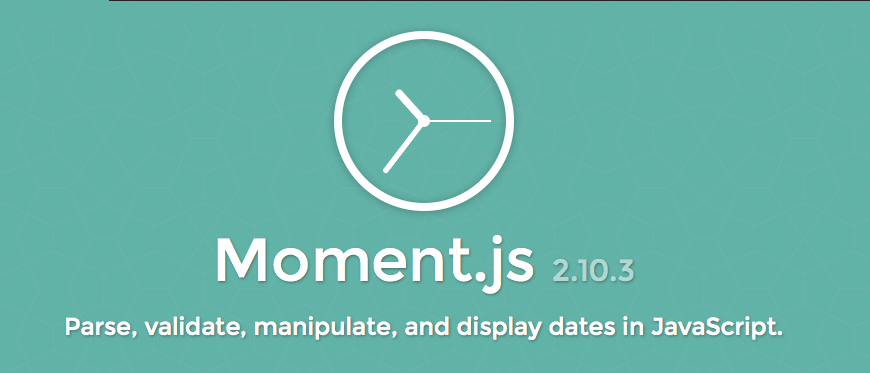

!SLIDE[bg=dr_nick.gif] background-fit

!SLIDE[bg=ali_1.jpeg]

!SLIDE[bg=ali_2.jpeg]

!SLIDE[bg=i_write_code.gif]

!SLIDE[bg=thinking.png] background-fit

!SLIDE[bg=table_flip.gif]

!SLIDE[bg=confused.jpg]

!SLIDE[bg=internet_1.png]

!SLIDE[bg=internet_2.png]

!SLIDE[bg=internet_3.png]

!SLIDE[bg=internet_4.png]

!SLIDE code

    @@@ JavaScript
    >> date = new Date(
      "2015-06-03T13:00:00+00:00"
    )

!SLIDE code
    @@@ JavaScript
    >> date = new Date(
      "2015-06-03T13:00:00+00:00"
    )

    > Date 2015-06-03T13:00:00.000Z

!SLIDE code
    @@@ JavaScript
    >> date.toString()

!SLIDE code
    @@@ JavaScript
    >> date.toString()
    
    > "Wed Jun 03 2015 09:00:00 GMT-0400 (EDT)"

!SLIDE code
    @@@ JavaScript
    >> // Wednesday, June 3, 2015 - 9:00 AM

!SLIDE code
    @@@ JavaScript
    >> // Wednesday

!SLIDE[bg=get_day.png] background-fit

!SLIDE code
    @@@ JavaScript
    >> // Wednesday, June 3, 2015 - 9:00 AM

    >> date.getDay()

!SLIDE code
    @@@ JavaScript
    >> // Wednesday, June 3, 2015 - 9:00 AM

    >> date.getDay()

    > 3

!SLIDE code
    @@@ JavaScript
    >> weekdays = [
         "Sunday",
         "Monday",
         "Tuesday",
         "Wednesday",
         "Thurday",
         "Friday",
         "Saturday"
       ]

!SLIDE code
    @@@ JavaScript
    >> weekdays[date.getDay()]

!SLIDE code
    @@@ JavaScript
    >> weekdays[date.getDay()]

    > "Wednesday"

!SLIDE code
    @@@ JavaScript
    >> weekdays[date.getDay()]

    > "Wednesday"

    >> // Wednesday, June 3, 2015 - 9:00 AM

!SLIDE code
    @@@ JavaScript
    >> weekdays[date.getDay()] +

!SLIDE code
    @@@ JavaScript
    >> weekdays[date.getDay()] +
         ", " +

!SLIDE code
    @@@ JavaScript
    >> weekdays[date.getDay()] +
         ", " +
         months[date.getMonth()] +

!SLIDE code
    @@@ JavaScript
    >> weekdays[date.getDay()] +
         ", " +
         months[date.getMonth()] +
         date.getDate() +

!SLIDE code
    @@@ JavaScript
    >> weekdays[date.getDay()] +
         ", " +
         months[date.getMonth()] +
         date.getDate() +
         "," +

!SLIDE code
    @@@ JavaScript
    >> weekdays[date.getDay()] +
         ", " +
         months[date.getMonth()] +
         date.getDate() +
         "," +
         date.getFullYear() +

!SLIDE code
    @@@ JavaScript
    >> weekdays[date.getDay()] +
         ", " +
         months[date.getMonth()] +
         date.getDate() +
         "," +
         date.getFullYear() +
         " - " +

!SLIDE code
    @@@ JavaScript
    >> weekdays[date.getDay()] +
         ", " +
         months[date.getMonth()] +
         date.getDate() +
         "," +
         date.getFullYear() +
         " - " +
         date.toLocaleTimeString()

!SLIDE code
    @@@ JavaScript
    > "Wednesday, June3,2015 - 9:00:00 AM"

!SLIDE code
    @@@ JavaScript
    > "Wednesday, June3,2015 - 9:00:00 AM"

  

!SLIDE code
    @@@ JavaScript
    >> weekdays[date.getDay()] +
         ", " +
         months[date.getMonth()] +
         date.getDate() +
         "," +
         date.getFullYear() +
         " - " +
         date.toLocaleTimeString()

!SLIDE
 

!SLIDE center
  

!SLIDE code
    @@@ JavaScript
    >> moment("2015-06-03T13:00:00+00:00")

    > Object { _isAMomentObject: true, ... }

!SLIDE code
    @@@ JavaScript
    >> aBetterDate =
         moment("2015-06-03T13:00:00+00:00")

    >> aBetterDate.
         format("dddd, MMMM D, YYYY - h:mm A")

!SLIDE code
    @@@ JavaScript
    >> aBetterDate =
         moment("2015-06-03T13:00:00+00:00")

    >> aBetterDate.
         format("dddd, MMMM D, YYYY - h:mm A")

    > "Wednesday, June 3, 2015 - 9:00 AM"

!SLIDE[bg=yay.gif]
